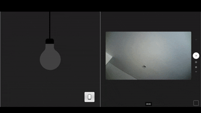

# Homelink

**Homelink** is a lightweight Node.js web server designed to store and manage data, also made to control devices, from [Home Assistant](https://www.home-assistant.io/). It uses a MariaDB database for persistence and provides a RESTful API for interacting with home automation data.

## 🌐 Overview

Homelink acts as a backend for collecting and querying smart home data from Home Assistant. It's built with:

- **Node.js** — Fast and scalable backend
- **MariaDB** — Reliable relational database
- **Express.js** — Web server and REST API framework
- **Docker** — Easy deployment and development environment

---

## 🚀 Features

- Collects and stores data from Home Assistant
- REST API for querying stored data
- Easily extensible with new endpoints or data types
- Dockerized for quick setup and deployment

---

## 📁 Project Structure

```

homelink/
│
├── docker/                     # Docker-related config files
│   ├── mariadb/                # MariaDB-specific Docker config
│   │   └── init.sql            # DB schema or initialization script
│   └── node/                   # Node.js-specific Docker config
│       └── Dockerfile          # Dockerfile for Node.js server
│
├── src/                        # Main server application code
│   └── server.js               # App entry point
│
├── web/                        # Static frontend (or frontend source code)
│   └── index.html              # Or a framework like React/Vue here
│
├── .env.example                # Environment variables
├── .gitignore
├── compose.yml                 # Docker Compose config
├── package.json
└── README.md


````

---

## ⚙️ Setup Instructions

### 1. Clone the repository

```bash
git clone https://github.com/oOmyLoveOo/Homelink.git
cd homelink
````

### 2. Create the environment file

Copy the example and update values as needed:

```bash
cp .env.example .env
```

### 3. Run with Docker Compose

```bash
docker-compose up --build
```

This will start the Node.js server and a MariaDB database.

---

## 🎬 Demo



---

## 📬 API Endpoints

> *More detailed API documentation is not coming soon.*

Example:

```
GET /api/devices           # List all devices
POST /api/events           # Store a new event from Home Assistant
GET /api/events/:id        # Fetch a specific event
```

---

## 🛠 Technologies Used

* **Node.js**
* **Express**
* **MariaDB**
* **Docker**
* **dotenv**
* **mysql2** or **mariadb** (DB client)
* **Jest** or **Mocha/Chai** (for testing)

---

## 🧪 Running Tests

```bash
npm install
npm test
```

---

## 📝 License

MIT License

---

## 🤝 Contributing

This a small FP proyect made for academic purposes (likely not to be continued).

---

## 📡 Integration with Home Assistant

Homelink expects Home Assistant to send data via HTTP requests (webhooks or automation scripts). You can set up automations in Home Assistant that trigger on events and POST data to the Homelink API.

Example Home Assistant automation snippet:

```yaml
- alias: Send Light Event
  trigger:
    platform: state
    entity_id: light.living_room
  action:
    - service: rest_command.send_event
```

Make sure to configure the `rest_command` in your Home Assistant `configuration.yaml`.